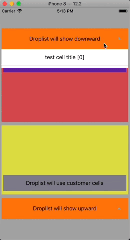

# ChainedDroplist

> 链式Droplist，提供了基本的 DataSource 和 Delegate 的封装
> 尽量做到最大化的 Cell 扩展
> 欢迎issues和PRs，帮助改善


最近项目中经常遇到 下拉/上拉列表(droplist) 的需求，共性比较多，但是会有细微的差异；首选当然是用`UITableView`，但是如果每个droplist都创建个`datasource`，`delegate`未免也太麻烦了；索性抽出点时间封装了一个简单的链式Droplist，主要满足以下几种需求：
- 使用 chain-style program（_在一个方法里完成 droplist cell组装、展示、选择 的处理_）
- 提供可选的 droplist hostview（_并不是所有 dropilst 都直接简单粗暴的加载在 KeyWindow 上_）
- 提供 可选的 tap rotation icon（_点击、展示droplist应该伴随着icon的旋转，不是么？_）
- 提供可选的 droplist baseView（_droplist应该在点击view的下沿或者上沿进行伸展_）
- 上方/下发 展示空间不足会主动调整展开方向（_相信我，虽然用户不在意，但是总会我测试会提这个bug的_）
- 默认展示**5**行，如果展示空间不足，自动**-1**直至可以满足展示条件(_小屏用户的体验还是要考虑的_)
- Cell支持可最大化扩展，目前建议使用继承方式（_你永远不知道下一个设计师能设计出来什么_）

先来看个简单的说明：




先看下使用方法，有个基本思路：

```ObjC

- (void)showDroplist:(UIView *)baseView icon:(UIView *)icon hostView:(UIView *)hostView
{
    [[[[[ChainedDroplistView alloc] initWithConfig:^(ChainedDroplistView *droplist) {
        droplist.hostView = self.view; /* 展示droplist的父view，默认为Window */
        droplist.baseView = baseView; /* 用于确定 droplist 的 top/bottom */
        droplist.rotationView = icon; /* 展示droplist的同时做旋转的view */
        droplist.cellHeight = 60; /* 默认Cell height */
        droplist.datas = [self createTestDatas]; /* 创建 cell datas */
    }] registCustomerCellsWithConfig:^(UITableView *tableView) {
        /* 绑定 Cell Identifier */ 
        [tableView registerClass:ChainedDroplistBaseCell.class forCellReuseIdentifier:kChainedDroplistBaseCellIdentifier];
    }] show] /* 调用 show 之后会执行展示动画 */
        processAfterSelected:^(NSInteger index) {
        /* 用户选中某个 Cell 后会执行该 block */
        NSLog(@"U have selected index -> [%@]", @(index));
    }];
    
}

```


### 代码结构

基于`UITableView`封装，通过 `ChainedDroplistModelProtocol` 和 `ChainedDroplistCellProtocol` 来衔接 Cell 和 Model

##### ChainedDroplistModelProtocol

- 提供 `registerClass:forCellReuseIdentifier:` 的 identifier
- 可以直接继承 `ChainedDroplistBaseModel`，重写 `- (NSString *)strCellIdentifier` 方法提供自定义 identifier

##### Cell

- `configCellWithModel:` 在每个 `tableView: cellForRowAtIndexPath:` 方法中都会调用，该方法中可以根据model更新Cell

关键代码：
```ObjC
- (UITableViewCell *)tableView:(UITableView *)tableView cellForRowAtIndexPath:(NSIndexPath *)indexPath
{
    
    NSInteger index = indexPath.row;
    NSAssert(index < self.cellDatas.count, @"index[%@] beyonds the max count[%@] of datas", @(index), @(self.cellDatas.count));

    // 根据 ChainedDroplistModelProtocol strCellIdentifier 获取指定Cell
    id<ChainedDroplistModelProtocol> model = self.cellDatas[index];
    UITableViewCell *cell = [tableView dequeueReusableCellWithIdentifier:model.strCellIdentifier];
    NSAssert([cell conformsToProtocol:@protocol(ChainedDroplistCellProtocol)],
             @"cell[%@] from identifier[%@] must conforms protocol [%@]",
             cell, model.strCellIdentifier, NSStringFromProtocol(@protocol(ChainedDroplistCellProtocol)));
    UITableViewCell <ChainedDroplistCellProtocol> * droplistCell = (UITableViewCell <ChainedDroplistCellProtocol> *)cell;
    
    if ([droplistCell respondsToSelector:@selector(configCellWithModel:)]) {
        // 刷新Cell
        [droplistCell configCellWithModel:model];
    }
    
    return droplistCell;
}
```

- `ChainedDroplistBaseCell`中`initWithStyle: reuseIdentifier:`调用了 `setupUI`、`setupConstraints`用于设置UI和约束， 可以直接继承 `ChainedDroplistBaseCell`，重写 `setupUI` `setupConstraints` 完成 Customer cell 的定义

```ObjC
- (instancetype)initWithStyle:(UITableViewCellStyle)style reuseIdentifier:(NSString *)reuseIdentifier
{
    self = [super initWithStyle:style reuseIdentifier:reuseIdentifier];
    if (self) {
        self.selectionStyle = UITableViewCellSelectionStyleNone;

        [self setupUI];
        [self setupConstraints];
    }
    
    return self;
}
```

`identifier` 的声明和定义
- 在Model中利用 `FOUNDATION_EXPORT NSString *const identifier` 声明`identifier`
- 在Cell中定义相关 `identifier`:  `NSString *const identifier=@"identifier"`

这么做只是为了通过简单的 `identifier` 搜索就可以找出 cell 和对应的 model


### Sample

想了解的同学可以参考示例中的使用方法

1. `cd Example/`
2. run `pod update --no-repo-update`
3. `open ChainedDroplist.xcworkspace/`

为了尽可能说明`ChainDroplist`的设计初衷，示例中列举了比较详细的使用场景，包括：

1. 默认场景：向下展开，**5行**可见
2. 向下展示空间不足：根据 `hostView` 和 `cellHeght` 来计算可视空间，如果下方空间不足会改为**向上**展示
3. `rotationView`用于在展开droplist时做同步旋转
4. 如果 上方、下方 空间均不足以展示**5行**，主动计算**最少可展示行数**并展示
5. 通过继承 `ChainedDroplistBaseCell`、`ChainedDroplistBaseModel` 来实现自定义样式


## Requirements

## Installation

ChainedDroplist is available through [CocoaPods](https://cocoapods.org). To install
it, simply add the following line to your Podfile:

```ruby
pod 'ChainedDroplist'
```

## Author

seuzxh, zhaxianghui@htsc.com

## License

ChainedDroplist is available under the MIT license. See the LICENSE file for more info.
